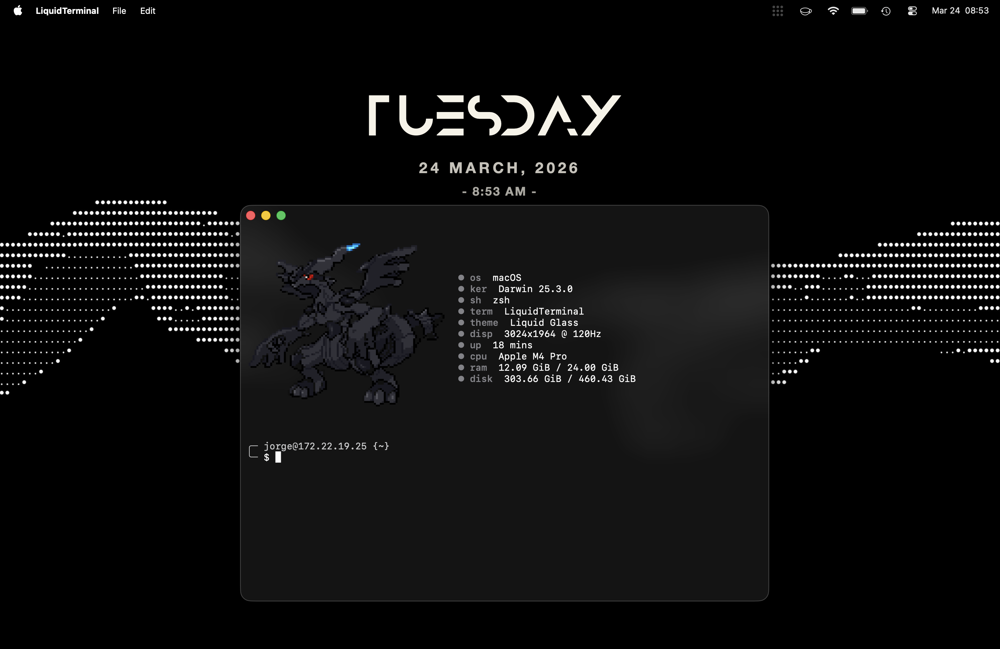
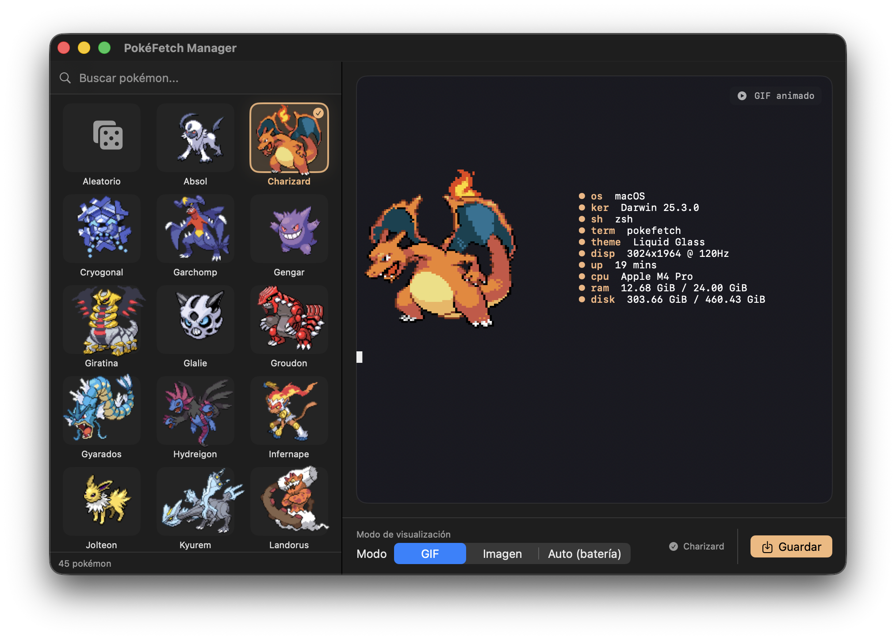

<p align="center">
  
  
  
  
  
</p>

<h1 align="center">⚡ pokefetch</h1>

<p align="center">
  <b>Animated Pokémon sprites in your terminal — powered by fastfetch</b>
</p>

<p align="center">
  
  
  
</p>

---

Every time you open your terminal, **pokefetch** picks a random Pokémon sprite, extracts its dominant color, and displays it alongside your system info via [fastfetch](https://github.com/fastfetch-cli/fastfetch).

## 📸 Preview

<p align="center">
  
</p>

<p align="center">
  
</p>

## ✨ Features

- 🎲 **Random Pokémon** — a different animated sprite on every terminal launch
- 🎨 **Dynamic colors** — key labels are tinted to match the Pokémon's palette (pastel)
- 🔋 **Battery aware** — shows a static frame on battery power to save resources
- 🖼️ **Pixel-perfect** — sprites are upscaled with nearest-neighbor to keep that crisp pixel-art look

## 📋 Requirements

| Dependency | Purpose |
|---|---|
| **macOS** | Currently macOS-only (uses `pmset`, Homebrew, iTerm image protocol) |
| **Terminal with image support** | Must support the [iTerm2 inline image protocol](https://iterm2.com/documentation-images.html) (iTerm2, WezTerm, Kitty, etc.) |
| [Homebrew](https://brew.sh) | Package manager — used to install the tools below |
| [fastfetch](https://github.com/fastfetch-cli/fastfetch) | System info display |
| [ImageMagick](https://imagemagick.org) | Image identification and pixel-art upscaling |
| [Python 3](https://python.org) + [Pillow](https://pillow.readthedocs.io) | Dominant color extraction |

> **Note:** The installer will automatically install any missing dependencies for you.

## 🚀 Quick Install

```bash
git clone https://github.com/YOUR_USERNAME/pokefetch.git
cd pokefetch
chmod +x install.sh
./install.sh
```

Then open a **new terminal window** — you should see a random Pokémon!

## 📖 Step-by-Step Manual Install

If you prefer to install everything by hand:

### 1. Install dependencies

```bash
brew install fastfetch imagemagick python3
pip3 install Pillow
```

### 2. Copy files

```bash
mkdir -p ~/.config/fastfetch/pokemons

cp config.jsonc    ~/.config/fastfetch/
cp display_gif.sh  ~/.config/fastfetch/
cp get_pokemon.sh  ~/.config/fastfetch/
cp get_color.py    ~/.config/fastfetch/
cp pokemons/*.gif  ~/.config/fastfetch/pokemons/

chmod +x ~/.config/fastfetch/display_gif.sh
chmod +x ~/.config/fastfetch/get_pokemon.sh
```

### 3. Add to your shell

Add these lines to the end of your `~/.zshrc`:

```bash
# pokefetch
alias c='clear && $HOME/.config/fastfetch/display_gif.sh'
$HOME/.config/fastfetch/display_gif.sh
```

### 4. Reload your shell

```bash
source ~/.zshrc
```

## 🎮 Usage

| Command | Description |
|---|---|
| Open a new terminal | A random Pokémon appears automatically |
| `c` | Clear the screen and show a new random Pokémon |

## ➕ Adding Custom Pokémon

1. Find or create an animated `.gif` sprite (pixel-art style works best)
2. Drop it into the `pokemons/` folder:
   ```bash
   cp my_pokemon.gif ~/.config/fastfetch/pokemons/
   ```
3. Open a new terminal — your new Pokémon is now in the rotation!

> **Tip:** Name the file after the Pokémon (e.g., `snorlax.gif`) to keep things tidy.

## 🗑️ Uninstall

```bash
cd pokefetch
chmod +x uninstall.sh
./uninstall.sh
```

This removes the pokefetch files and shell integration but **does not** uninstall dependencies (fastfetch, ImageMagick, etc.). To remove those too:

```bash
brew uninstall fastfetch imagemagick
pip3 uninstall Pillow
```

## 📁 Project Structure

```
pokefetch/
├── install.sh          # Automated installer
├── uninstall.sh        # Clean uninstaller
├── display_gif.sh      # Main script — picks, processes, and displays a Pokémon
├── get_pokemon.sh      # Helper — picks a random file from a directory
├── get_color.py        # Extracts the dominant pastel color from a sprite
├── config.jsonc        # fastfetch configuration (modules, layout)
└── pokemons/           # Animated Pokémon GIF sprites (~139 included)
```

## 🙏 Credits

- Sprites from [Pokémon Black/White](https://pokemondb.net/sprites) (Generation V animated sprites)
- System info by [fastfetch](https://github.com/fastfetch-cli/fastfetch)

## 📄 License

MIT — feel free to use, modify, and share!
